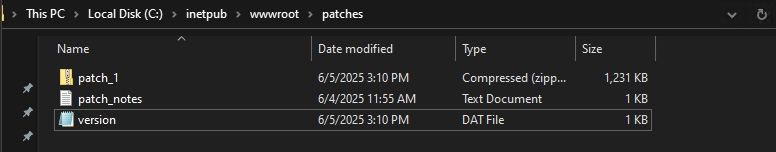

# Python Game Launcher & Patcher

A simple, customizable launcher and patching system for games written in Python using `tkinter`. This launcher checks the user's game version, downloads missing patches from a remote host, and extracts them to the root folder.

---

## 🚀 Quick Setup

### 1. Clone and Install Requirements

```bash
python3 -m venv venv
source venv/bin/activate  # or venv\Scripts\activate on Windows
pip install -r requirements.txt
```

> Make sure to install [`pyinstaller`](https://pyinstaller.org/) globally if you plan to build an executable:
```bash
pip install pyinstaller
```

---

### 2. Configure Launcher Settings

Edit `constants.py`:

```python
BASE_URL = "http://your-server-address/patches"
PATCH_NOTES_URL = f"{BASE_URL}/patch_notes.txt"
```

- `version.dat` must exist at the root of your `BASE_URL`.
- Patch files must be in the format `patch_1.zip`, `patch_2.zip`, etc., unless you modify the format in `constants.py`.

---

### 3. Folder Structure

The launcher **must** be placed inside your game’s root folder:

```
game_directory/
├── main.exe (compiled launcher)
├── version.dat
├── assets/
│   ├── background.png
│   ├── play_enabled.png
│   └── play_disabled.png
├── temp/             # Automatically created
├── game_files/       # Your actual game contents
```

- All patch files will be extracted directly into the **current working directory** where the launcher resides.
- The `assets` folder must be present for the launcher UI to work properly.

---

### 4. Example Hosting Setup

You may use any server to host patches, including:
- Local network servers (e.g., IIS on Windows Server)
- Public web hosts
- Python `http.server` (for testing)

Example `patches/` directory on your host:
```
patches/
├── version.dat
├── patch_1.zip
├── patch_2.zip
└── patch_notes.txt
```

A sample screenshot and demo video of this setup in action are included in the repo.

---

### 5. Build Executable (Optional)

If you're on Windows:

```bash
pyinstaller main.py --name Launcher --onefile --windowed
```

This creates a standalone `Launcher.exe` inside `dist/`.

---

## ✅ Notes

- `version.dat` is automatically created on first patch if missing.
- SHA checking logic can be added for integrity verification.
- The `play` button only appears once patching completes successfully.
- Designed to be easy to modify and reuse across games.

---

## 📸 Demo



🎥 [Watch Launcher in Action](demo/demo_video.mp4)

---